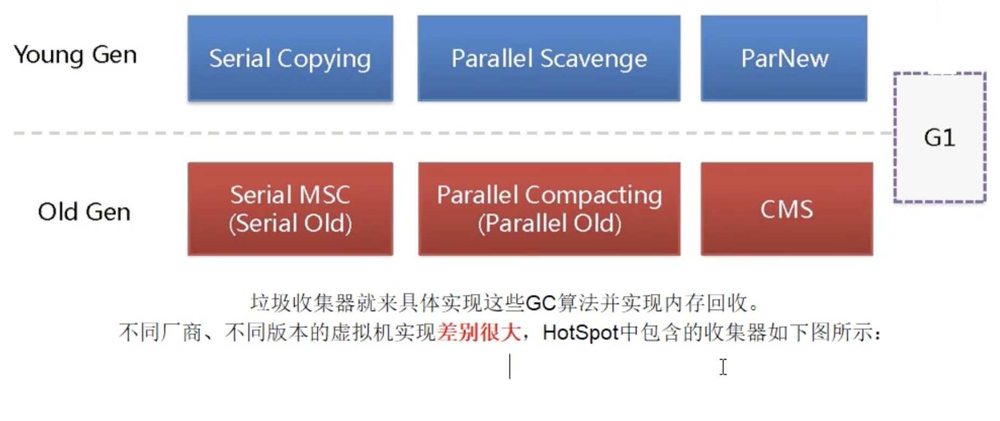
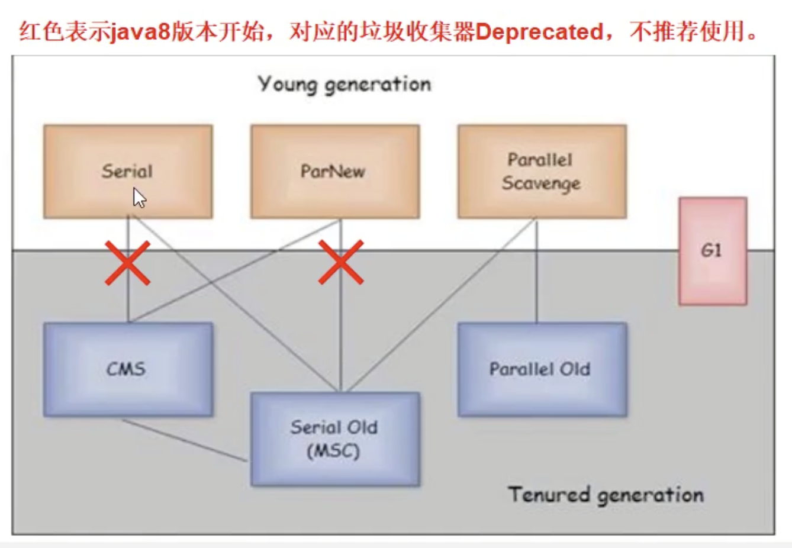
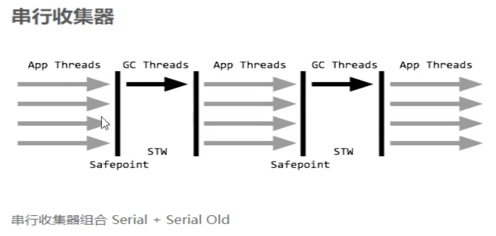
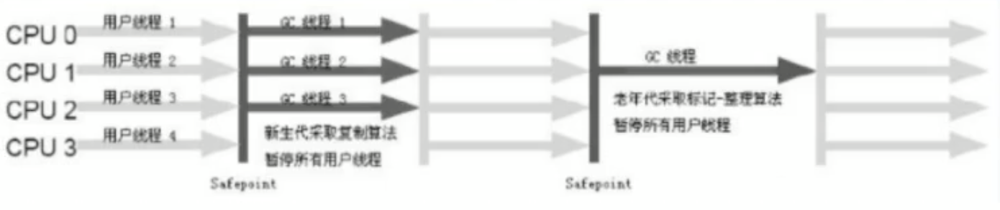
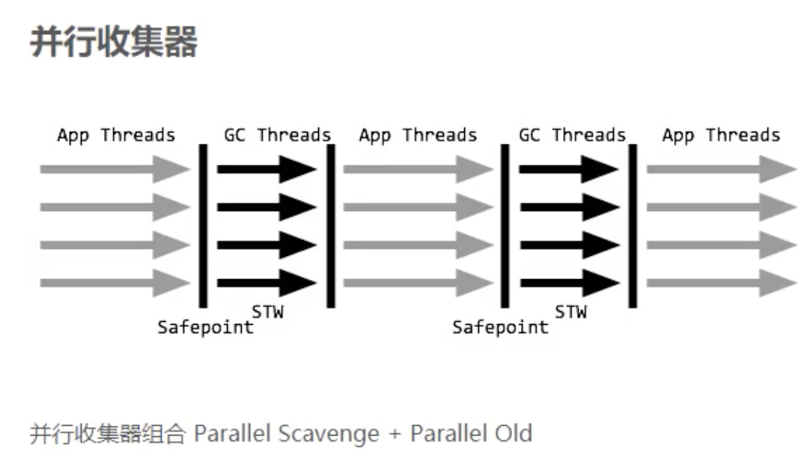
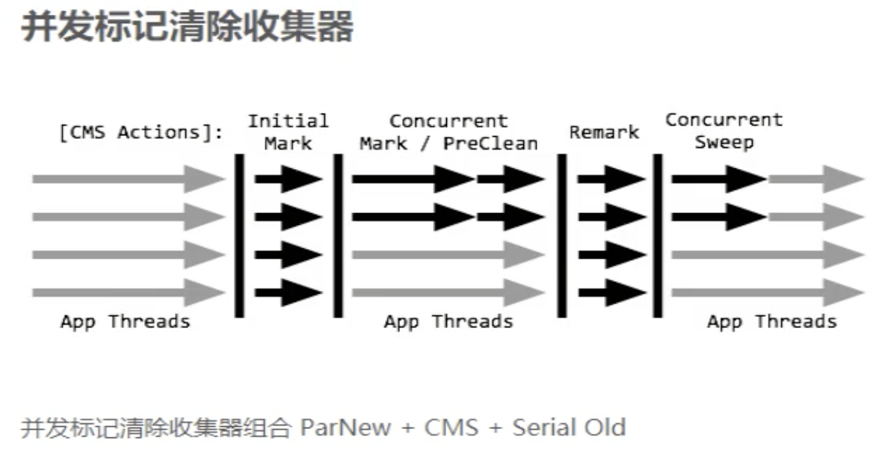
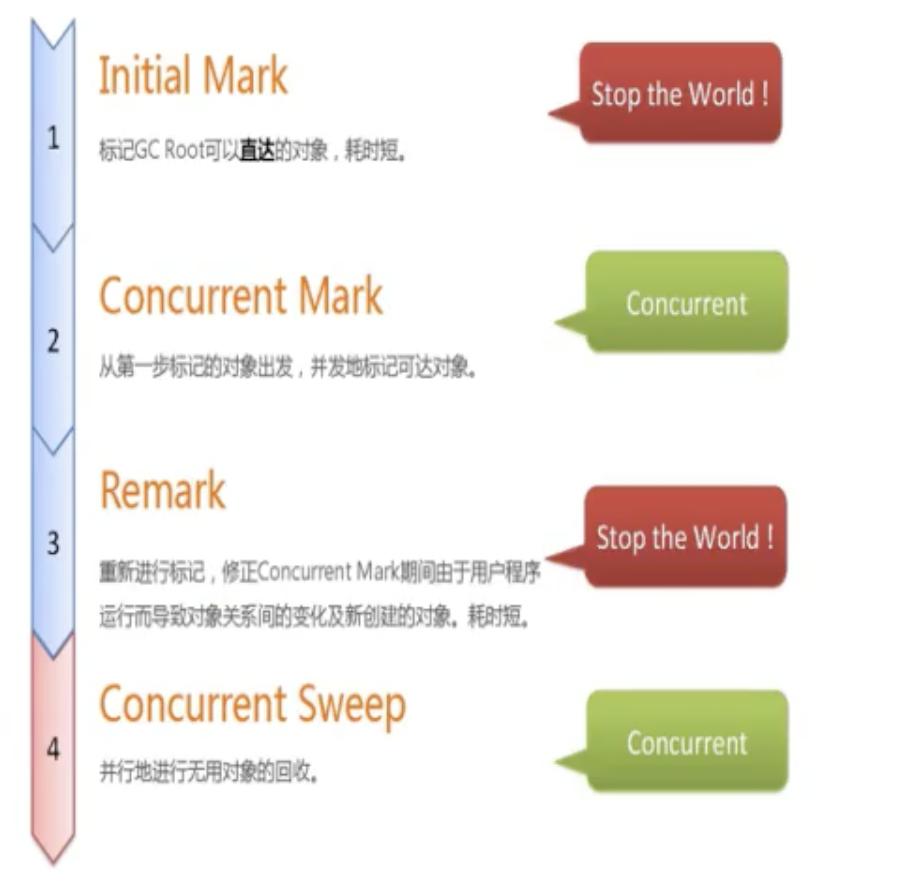

# 垃圾回收器

## 4种主要垃圾收集器

### 串行垃圾回收器（Serial）

-XX:+UseSerialGC

它为单线程环境设计且只使用一个线程进行垃圾回收，会暂停所有的用户线程，所以不是和服务器环境。

### 并行垃圾回收器（Parallel）

-XX:+UseParallelGC

多个垃圾收集线程并行工作，此时用户线程是暂停的，适用于科学计算/大数据处理首台处理等弱交互场景。

### 并发垃圾回收器（CMS）

用户线程和垃圾收集线程同时执行（不一定是并行，可能交替执行），不需要停顿用户线程，互联网公司多用他，适用对相应时间又要求的场景。

### garbage first（G1）垃圾回收器

G1垃圾回收器将堆内存分割成不同的区域然后并发的对其进行垃圾回收。

## 怎么查看JVM默认垃圾收集器

java -XX:+PrintCommandLineFlags -version

### java的GC回收类型主要有几种：

UseSerialGC、UseSerialOldGC（基本没人用）、UseParNewGC、UseParallelGC、UseParallelOldGC、UseConcMarkSweepGC、UseG1GC

### 垃圾收集器的分布：

### Java8版本的垃圾收集器

### 部分参数预先说明

DefNew：Default New Generation

Tenured：Old

ParNew：Parallel New Generation

PSYoungGen：Parallel Scavenge

ParOldGen：Parallel Old Generation

## Server/Client模式

适用范围：只需要掌握Server模式即可，Client模式基本不会用

操作系统：

32位Windows操作系统，不论硬件如何都默认使用Client的JVM模式。

32位其他操作系统。2G内存同时有两个CPU以上用Server模式，低于该配置还是Client模式

64位，Only Server模式

## 串行收集器（Serial收集器）

一句话：一个单线程的收集器，在进行垃圾收集时候，必须暂停其他所有的工作线程知道它收集结束。

串行收集器是最古老，最稳定以及效率最高的收集器，只使用一个线程去回收但其在垃圾收集过程中可能会产生较长的停顿（”stop the world“状态）

Serial垃圾收集器是java虚拟机运行在Client模式下默认的新生代垃圾收集器。

对应JVM参数是：-XX:+UseSerialGC

开启后会使用：Serial（Young区使用）+Serial Old（Old区使用）的收集器组合

表示：新生代老年代都会使用串行回收收集器，新生代使用复制算法，老年代使用标记整理算法。

## ParNew（并行）收集器

一句话：使用多线程进行垃圾回收，在垃圾收集时，会Stop-The-World暂停其他所有的工作线程直到它收集结束。

ParNew收集器其实就是Serial收集器新生代的并行多线程版本，最常见的应用场景是配合老年代的CMS GC工作，其余的行为和Serial收集器完全一样，ParNew垃圾收集器在垃圾收集过程中同样也要暂停其他所有的工作线程。他是很多java虚拟机工作在Server模式下新生代的默认垃圾收集器。

常用对应参数：-XX:+UseParNewGC 启用ParNew收集器，只影响新生代的收集，不影响老年代

开启上述参数后，会使用：ParNew（Young区用）+Serial Old的收集器组合，新生代使用复制算法，老年代使用标记整理算法。

但是ParNew+Serial Old的组合，java8已经不推荐使用

Java HotSpot(TM) 64-Bit Server VM warning: Using the ParNew young collector with the Serial old collector is deprecated and will likely be removed in a future release

备注：-XX:ParallelGCThreads 限制线程数量，默认开启和CPU数目相同的线程数

## Parallel Scavenge/Parallel Old （并行回收器）

Parallel Scavenge 收集器类似ParNew也是一个新生代垃圾收集器，使用复制算法，也是一个并行的多线程垃圾收集器，俗称吞吐量优先收集器。

一句话：串行收集器在新生代和老年代的并行化

它重点关注的是：

可控的吞吐量（ToughPut=运行用户代码时间/（运行用户代码时间+垃圾收集时间）），高吞吐量意味着高效利用CPU的时间，他多用于在后台计算而不需要太多交互的任务。

自适应调节策略也是Parallel Scavenge垃圾收集器和ParNew垃圾收集器的一个重要区别。（自适应调节策略：虚拟机会根据当前系统的运行情况收集性能监控信息，动态调整这些参数以提供最合适的停顿时间（-XX:MaxGCPauseMills））或最大的吞吐量。

常用JVM参数：-XX:+UseParallelGC或者-XX:UseParallelOldGC（可以相互激活）使用Parallel Scavenge收集器

开启该参数后：新生代使用复制算法，老年代使用标记整理算法。

多说一句：-XX:ParallelGCThreads=数字N表示启动多少个GC线程

CPU>8      N=5/8

CPU<8      N=实际个数

## 并发标记清除垃圾回收器（CMS）

CMS收集器（Concurrent Mark Sweep：并发标记清除）是一种以获取最短回收停顿时间为目标的收集器。

适合应用在互联网站或者B/S系统的服务器上，这类应用尤其重视服务器的相应速度，希望系统停顿时间最短。

CMS非常适合堆内存大、CPU核数多的服务器端应用，也是G1出现之前大型应用的首选收集器。

Concurrent Mark Sweep 并发标记清除，并发收集低停顿，并发指的是与用户线程一起执行。

开启该收集器的JVM参数：-XX:+UseConcMarkSweepGC 开启该参数后会自动将-XX:+UseParNewGC打开

开启该参数后，使用ParNew（Young区）+CMS（Old区 ）+Serial Old的收集器组合，Serial Old将作为CMS出错的后备收集器

### 4步过程

1. 初始标记（CMS initial mark）

   只是标记一下GC Roots能直接关联的对象，速度很快，仍然需要暂停所有的工作线程

2. 并发标记（CMS concurrent mark）和用户线程一起

   进行GC Roots跟踪的过程，和用户线程一起工作，不需要暂停工作线程。主要标记过程，标记全部对象。

3. 重新标记（CMS remark）

   为了修正在并发标记期间，因用户程序继续运行而导致标记产生变动的那一部分对象的标记记录，仍然需要暂停所有工作线程。

   由于并发标记时，用户线程仍然运行，因此在正式清理前，再做修正

4. 并发清除（CMS concurrent sweep）和用户线程一起

   清除GC Roots不可达对象，和用户线程一起工作，不需要暂停工作线程。基于标记结果，直接清理对象。

   由于耗时最长的并发标记和并发清除过程中，垃圾收集线程可以和用户线程一起并发工作，所以总体上看CMS收集器的内存回收和用户线程是一起并发的执行。

   

### 优缺点

优点：并发收集停顿低

缺点：

1. 并发执行堆CPU压力大

   由于并发进行，CMS在收集与应用线程会同时增加对堆内存的占用，也就是说，CMS必须要在老年代对内存用完之前完成垃圾回收，否则CMS回收失败时，将触发担保机制，串行老年代收集器将会以STW的方式进行一次GC，从而造成较大停顿时间。

2. 采用标记清除算法会产生大量碎片

   标记清除算法无法整理空间碎片，老年代空间会随应用时长被逐步耗尽，最后将不得不通过担保机制对堆内存进行压缩。CMS提供参数-XX:CMSFullGCsBeForeCompaction（默认0，即每次都进行内存整理）来指定多少次CMS收集之后，进行一次压缩的Full GC。

## Serial Old垃圾收集器

