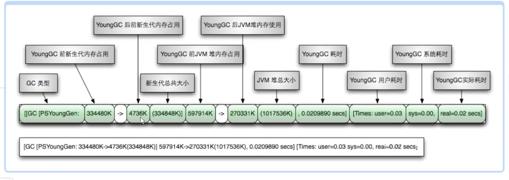

# jvm参数

## jvm的参数类型

### **标配参数**

-version -help java -showversion 在jdk各个版本之间稳定，很少有大的变化

### **X参数（了解）**

-Xint：解释执行   -Xcomp：第一次使用就编译成本地代码   -Xmixed：混合模式

### **XX参数**

#### Boolean类型：

公式：-XX:+或者-某个属性值（+表示开启，-表示关闭，可以通过jinfo -flag name pid 查看是否有被开启）

例如 -XX:+PrintGCDetails

#### KV设值类型：

公式：-XX:属性Key=属性值Value

例如-XX:MetaspaceSize=128m   -XX:MaxTenuringThreshold=15

## 查看jvm默认

java -XX:+PrintFlagsInitial -version

java -XX:+PrintFlagsFinal -version

=是默认的 :=改动过

java -XX:+PrintCommandLineFlags -version （打印命令行参数）

java8默认：-XX:InitialHeapSize=134217728 -XX:MaxHeapSize=2147483648 -XX:+PrintCommandLineFlags -XX:+PrintGCDetails -XX:+UseCompressedClassPointers -XX:+UseCompressedOops -XX:+UseParallelGC 

## 常用参数

**-Xms**：初始大小内存，默认为物理内存的1/64，等价于-XX:InitialHeapSize

**-Xmx**：最大分配内存，默认为物理内存的1/4，等价于-XX:MaxHeapSize

**-Xss**：设置单个线程栈的大小，一般默认为512k～1024k之间，等价于-XX:ThreadStackSize （如果是0则采用默认值）

**-Xmn**：设置年轻代大小

**-XX:MetaspaceSize**：设置元空间大小

**-XX:PrintGCDetails**：输出详细GC日志信息

**-XX:SurvivorRatio**：设置新生代中eden和s0/s1空间的比例

**默认**

-XX:SurvivorRatio=8，eden:s0:s1=8:1:1

假如-XX:SurvivorRatio=4，那么eden:s0:s1=4:1:1

SurvivorRatio的值就是设置eden区的比例占多少，s0、s1相同

**-XX:NewRatio**：配置新生代和老年代在堆结构中的占比

默认

-XX:NewRatio=2 新生代1，老年代2，新生代占整个堆的1/3

假如

-XX:NewRatio=4 新生代1，老年代4，新生代占整个堆的1/5

**-XX:MaxTenuringThreshold**：设置新生代垃圾最大年龄（默认15）